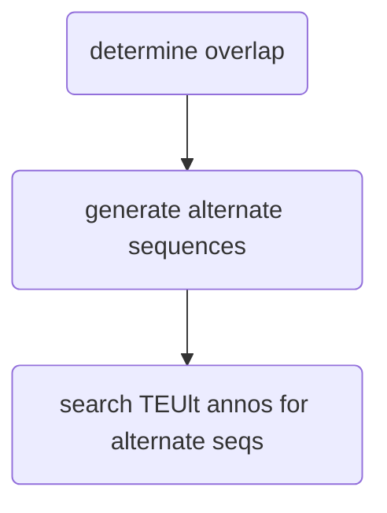

# MAPPING
---
## mapping workflow
- walkthrough of workflow for mapping/tracking individual transposon copies between generationally divided isolates of the same species
- most of this workflow is just concentrated within a humongous jupyter notebook that takes in all of the files and spits out a ton of info about unique TE copies (sequence, length, if/where they moved between strains, etc), files to make ideograms using RIdeogram package and other random bs

<table cellpadding="5" style="border: 1px solid black">
    <tr style="border: 1px solid black">
        <td style="border: 1px solid black" >INPUT</td>
        <td style="border: 1px solid black">size filtered gff3(s), txt file of chromosome lengths, SNPs between the 2 genomes being investigated in VCF format, bedtools intersect txt file</td>
    </tr>
    <tr>
        <td style="border: 1px solid black">OUTPUT</td>
        <td style="border: 1px solid black">list of unique TE sequences and locations in both genomes being investigated, files to create ideograms using RIdeogram R package</td>
    </tr>
</table>

- [ ] need to change jupyter notebook functions to deal with chromosome names being different between input files

## dependencies
- bedtools
- R
	- RIdeogram (package)